# CPU Architecture

## 1. System Overview

The project implements a custom **32-bit CPU in Logisim Evolution** based on a MIPS-inspired architecture.

The processor integrates the complete execution path required to run programs generated by the custom Python assembler. Machine instructions are stored in the instruction ROM and selected by the Program Counter. The Control Unit decodes each instruction and controls the register files, Integer Unit, memory interface and control-flow logic.

The current architecture contains an operational integer datapath. Floating-point components and the corresponding datapath are under development.

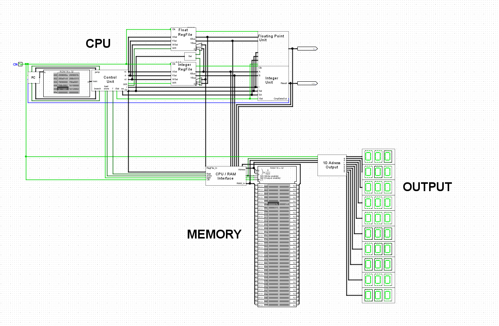

The main execution flow is:

```text
Program Counter
      ↓
Instruction ROM
      ↓
32-bit Instruction
      ↓
Control Unit
      ↓
Register File
      ↓
Integer Unit
      ↓
ALU / Multiplier / Divider
      ↓
Register Write-Back / RAM / Output
```

---

## 2. Control Unit

The **Control Unit** decodes the 32-bit instruction received from the instruction ROM and generates the signals required to control the processor.

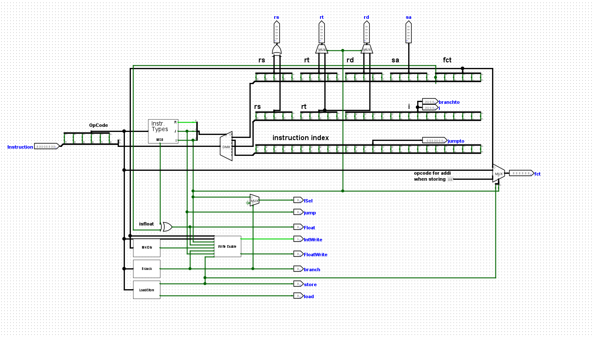

The instruction is separated into the fields required by the custom ISA, including:

- opcode
- `rs`
- `rt`
- `rd`
- shift amount
- function field
- immediate / branch target
- jump target

The instruction type is identified and the corresponding fields are routed to the required parts of the datapath.

The Control Unit generates signals for:

- register selection
- integer register write enable
- floating-point register write enable
- execution-unit selection
- load operations
- store operations
- branches
- jumps
- integer / floating-point datapath selection

This unit therefore provides the connection between the binary instruction encoding defined by the ISA and the actual hardware operations performed by the CPU.

---

## 3. Program Counter and Control Flow

The **Program Counter (PC)** determines the address of the instruction currently being executed.

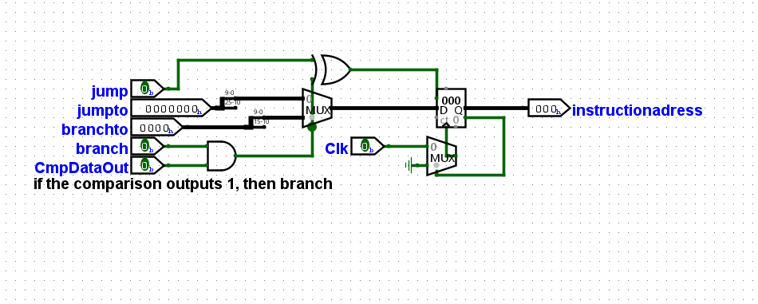

During sequential execution, the Program Counter advances to the next instruction.

The next instruction address can also be changed by:

- unconditional jumps
- conditional branches

For a conditional branch, the branch control signal is combined with the comparison result generated by the execution hardware. If the branch condition is satisfied, the branch target is selected as the next instruction address.

This mechanism enables loops, conditional execution and more complex algorithms.

---

## 4. Register File

The processor uses a **32-bit register architecture** with 5-bit register addresses.

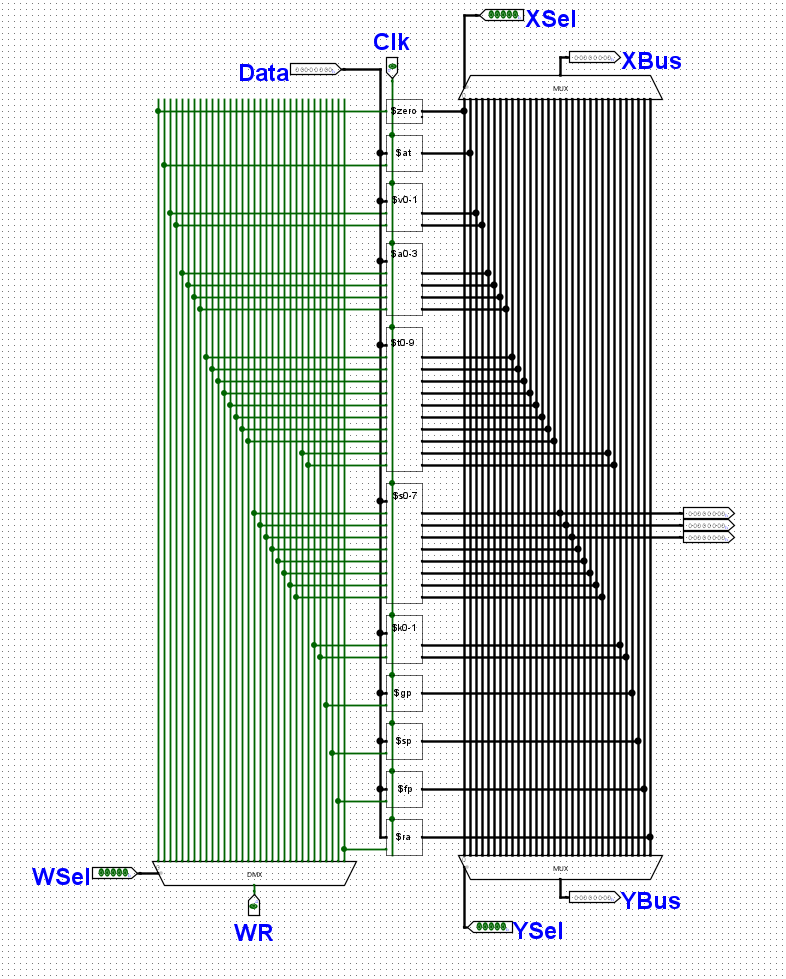

The register file provides:

- register selection for source operands
- register selection for the destination
- write-enable control
- 32-bit data input
- 32-bit data output

The integer registers follow a MIPS-inspired naming convention, including:

```text
$zero
$at
$v0 - $v1
$a0 - $a3
$t0 - $t9
$s0 - $s7
$k0 - $k1
$gp
$sp
$fp
$ra
```

The register file supplies operands to the execution hardware and receives calculated values through the write-back path.

---

# 5. Integer Unit

The **Integer Unit** combines the major integer execution components of the processor.

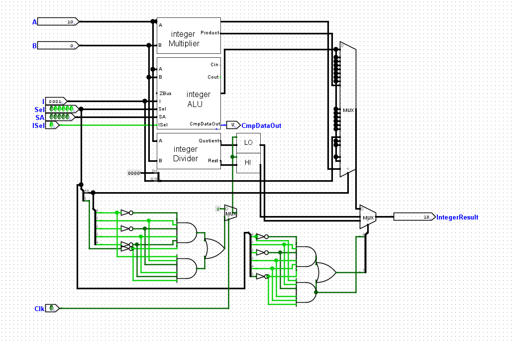

It contains three principal execution paths:

```text
                 ┌── ALU
Operands ────────┼── Multiplier
                 └── Divider
                       │
                       ▼
                 Result Selection
                       │
                       ▼
                  Integer Result
```

The Control Unit determines which operation is active and which result is forwarded to the processor datapath.

The Integer Unit therefore provides a common interface for different types of integer operations.

---

# 6. Arithmetic Logic Unit

The **32-bit ALU** combines several categories of operations into a single execution component.

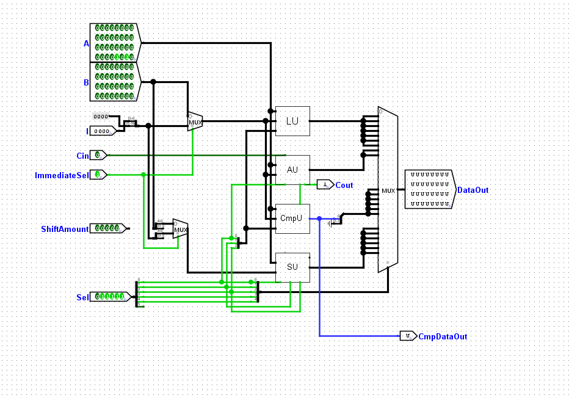

The ALU contains:

```text
ALU
├── Logic Unit
├── Arithmetic Unit
├── Comparator Unit
└── Shifter Unit
```

Multiplexers select the correct result depending on the operation specified by the instruction.

The ALU also supports immediate operands, allowing the second operand to originate either from a register or from the immediate field of an instruction.

---

## 6.1 Arithmetic Unit

The Arithmetic Unit performs the basic integer arithmetic operations.

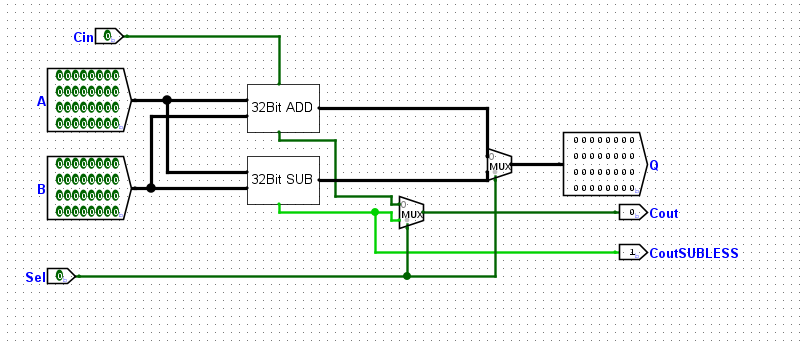

The unit contains separate 32-bit addition and subtraction paths and selects the required result according to the control input.

It also produces carry-related information used by other parts of the ALU.

---

## 6.2 Logic Unit

The Logic Unit implements bitwise operations on the two input operands.

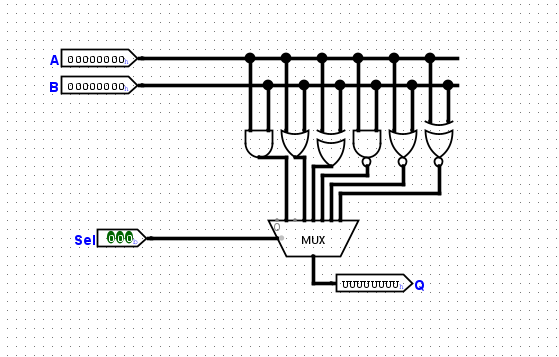

Supported logical operations include:

- AND
- OR
- XOR
- NAND
- NOR
- XNOR

The required result is selected through a multiplexer according to the ALU control signal.

---

## 6.3 Comparator Unit

The Comparator Unit performs relational comparisons between two integer operands.

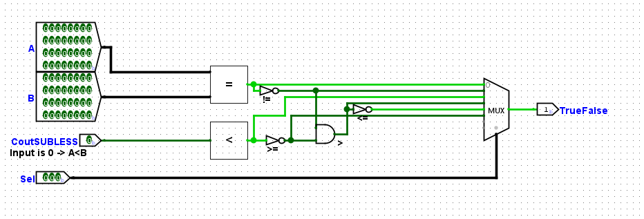

The unit combines equality and magnitude comparison logic to implement conditions such as:

```text
A == B
A != B
A < B
A > B
A <= B
A >= B
```

The selected comparison produces a Boolean result that can be used both by comparison instructions and by the branch logic.

---

## 6.4 Shifter Unit

The Shifter Unit implements the processor's shift and rotate operations.

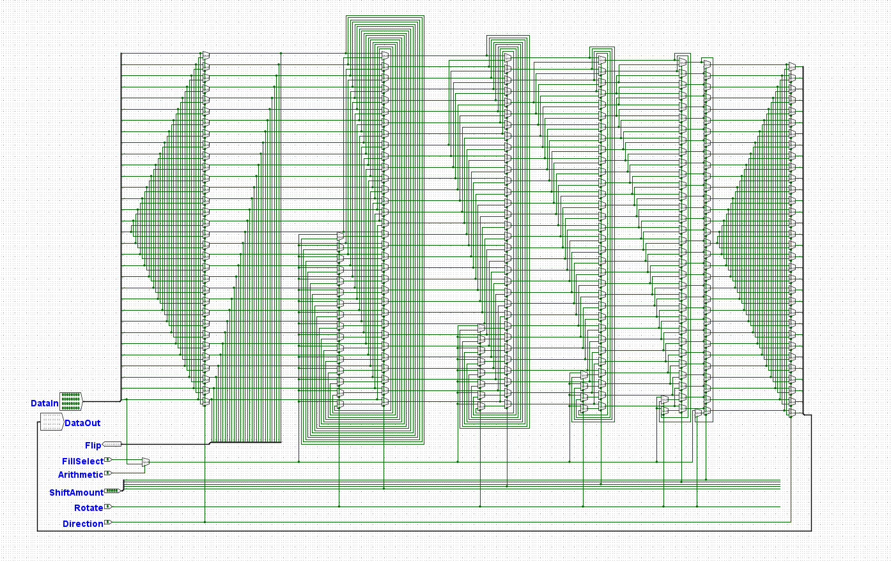

The circuit supports configurable shift amounts and different shift modes controlled by signals such as:

- arithmetic / logical shifting
- left / right direction
- rotate
- fill behavior

The shifter is implemented as a combinational network rather than performing repeated single-bit shifts over multiple clock cycles.

---

# 7. Integer Multiplier

Integer multiplication is implemented using a dedicated **combinational multiplier**.

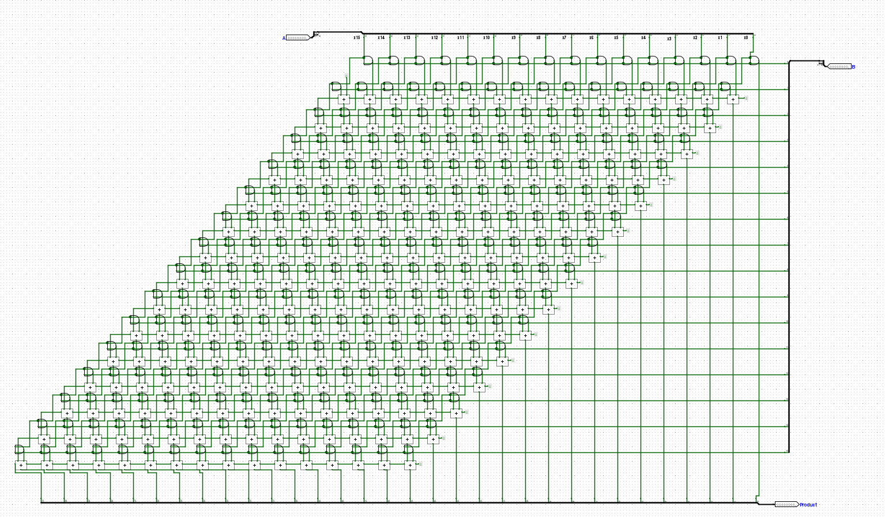

The multiplier operates on two **16-bit factors** and produces a complete **32-bit product**:

```text
16-bit A × 16-bit B → 32-bit Product
```

The circuit forms the required partial products and combines them through a network of adders.

Because the complete multiplication is implemented as combinational hardware, the processor does not need to execute a software multiplication algorithm or repeatedly shift and add values across multiple instructions.

The resulting 32-bit product fits directly into a general-purpose 32-bit register.

---

# 8. Integer Divider

Division is implemented using a dedicated **combinational divider**.

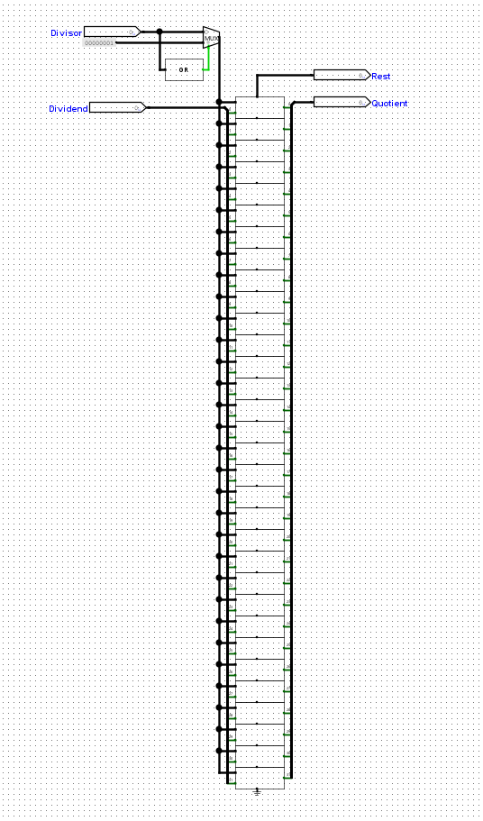

The divider consists of a sequence of repeated division stages.

Each stage performs one step of the division process and contributes one bit to the final quotient.

A single division stage is shown below:

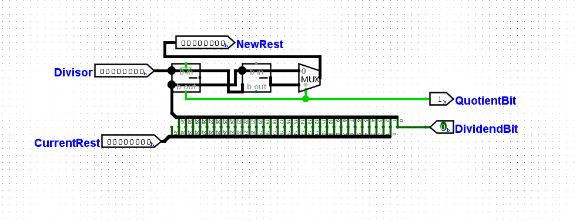

Each stage receives the current remainder and part of the dividend, compares the intermediate value with the divisor and determines:

- the next remainder
- one quotient bit

The stages are connected combinationally to produce the complete result.

The divider provides two outputs:

```text
Quotient
Remainder
```

These results are connected to the processor's dedicated result paths and can be transferred to general-purpose registers using the corresponding ISA instructions.

---

# 9. Memory System

The processor contains a separate **Data RAM** for values used during program execution.

The memory system is connected to the CPU through a dedicated interface.

## 9.1 CPU / RAM Interface

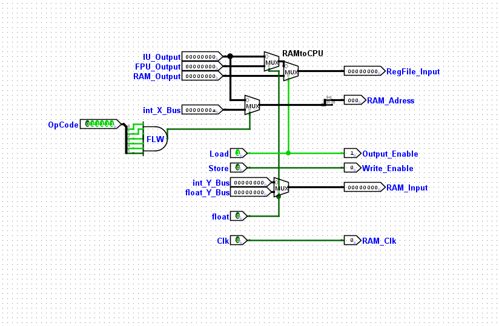

The interface controls:

- RAM address selection
- RAM data input
- RAM data output
- load operations
- store operations
- write enable
- output enable
- integer / floating-point data selection

For a store operation, data from the processor is routed to the RAM input.

For a load operation, the value returned by RAM is routed back toward the appropriate register file.

---

## 9.2 Data RAM

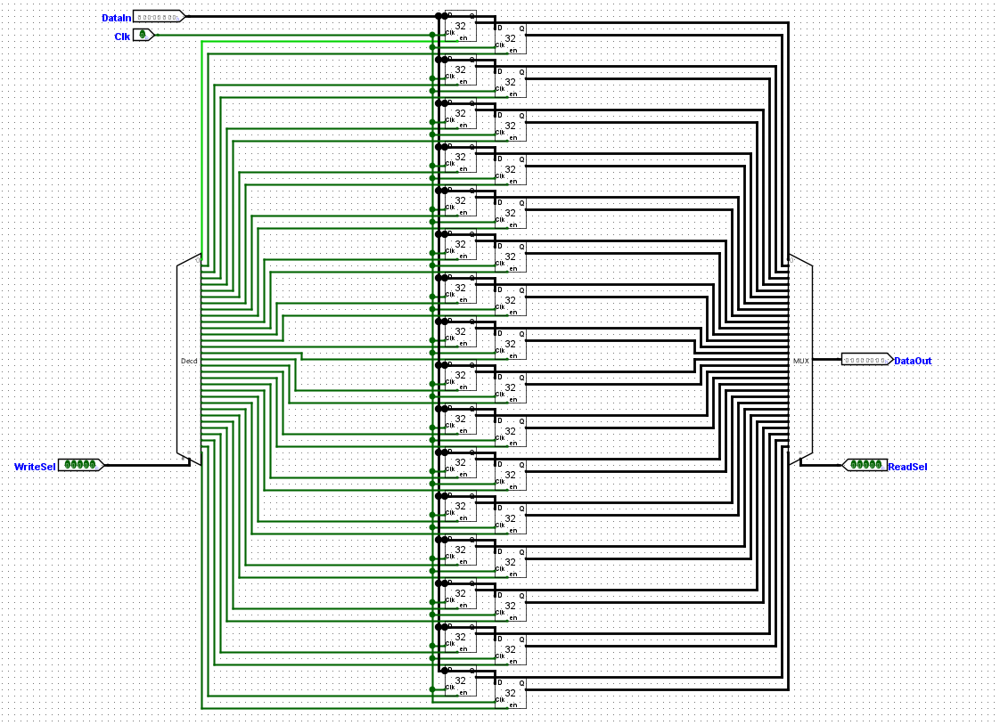

The RAM stores 32-bit values and allows programs to work with data outside the register file.

This makes it possible to implement:

- arrays
- temporary data storage
- load/store based algorithms
- sorting algorithms

The memory system therefore allows programs to operate on substantially more data than can be held directly in the CPU registers.

---

# 10. Decimal Output System

The processor includes an output system capable of displaying **multi-digit decimal integer values**.

A binary integer cannot be connected directly to multiple decimal 7-segment displays. It must first be converted into separate decimal digits.

This conversion is implemented using the **Double-Dabble algorithm**.

## 10.1 Double-Dabble Converter

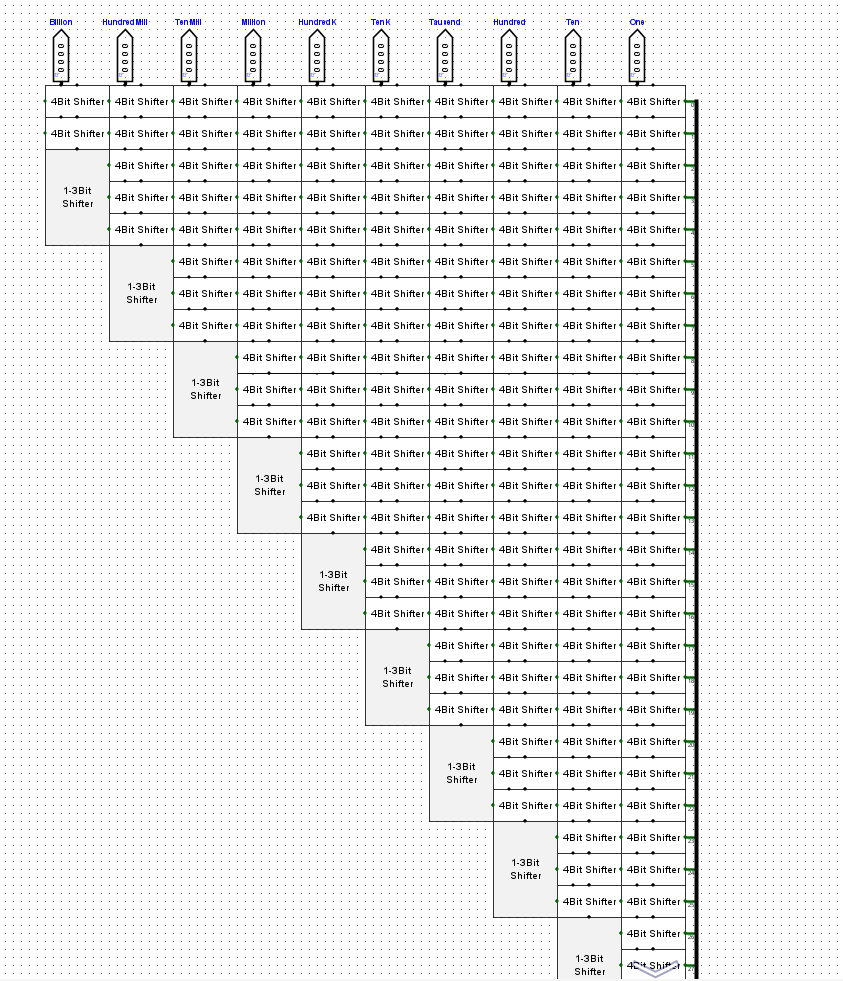

The circuit converts a binary integer into a Binary-Coded Decimal (BCD) representation.

Conceptually:

```text
32-bit Binary Integer
        ↓
Double-Dabble
        ↓
BCD Digits
        ↓
Billions
Hundred Millions
Ten Millions
Millions
Hundred Thousands
Ten Thousands
Thousands
Hundreds
Tens
Ones
        ↓
7-Segment Output
```

The implementation is constructed as a combinational network of shift and correction stages.

This allows a complete integer value to be displayed in decimal form instead of showing only individual binary or hexadecimal digits.

---

# 11. Complete Execution Path

Combining the individual components gives the following program execution path:

```text
Assembly Source
      │
      ▼
Python Assembler
      │
      ▼
32-bit Machine Code
      │
      ▼
Instruction ROM
      │
      ▼
Program Counter
      │
      ▼
Control Unit
      │
      ▼
Register File
      │
      ├───────────────┐
      │               │
      ▼               ▼
 Integer Unit       Data RAM
      │
 ┌────┼─────┐
 ▼    ▼     ▼
ALU  MUL   DIV
 │     │     │
 └─────┴─────┘
       │
       ▼
   Write Back
       │
       ├──► Register File
       │
       └──► Output System
                │
                ▼
          Double-Dabble
                │
                ▼
          7-Segment Display
```

The processor can therefore execute complete programs involving arithmetic, logic, comparisons, memory access and control flow rather than only demonstrating individual digital circuits.

---

# 12. Floating-Point Extension

The architecture already contains preparation for a separate floating-point datapath, including a floating-point register file and connections to the Control Unit and memory interface.

The custom ISA and Python assembler also define floating-point instruction encodings and floating-point registers.

However, the **Floating-Point Unit is currently under development** and should not yet be considered part of the completed and tested processor functionality.

The planned extension includes:

- floating-point addition
- floating-point subtraction
- floating-point multiplication
- floating-point division
- floating-point comparison
- integer / floating-point conversion
- floating-point load/store operations

The goal is to integrate the FPU alongside the existing Integer Unit while retaining the same instruction decoding and overall processor architecture.